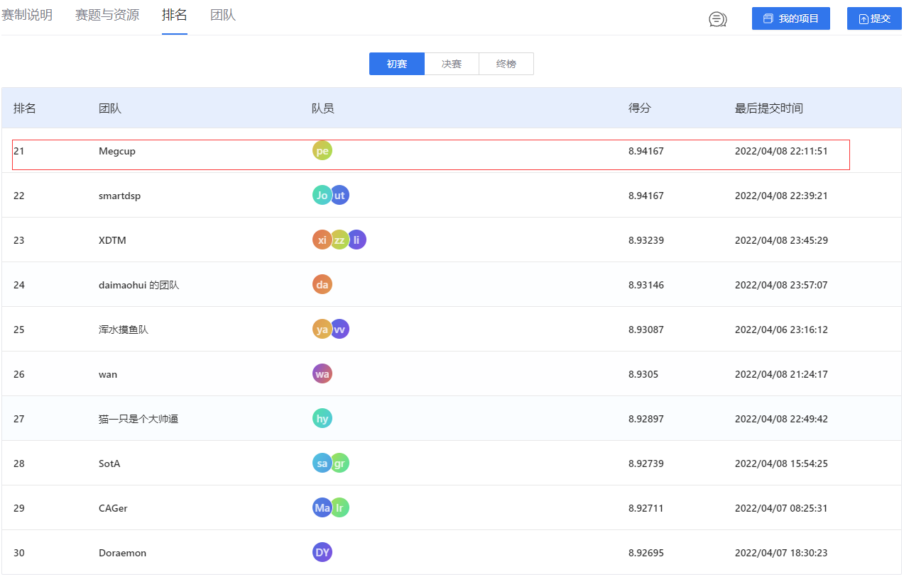

we use 2022 MegCup 炼丹大赛 train dataset, the [data](https://studio.brainpp.com/dataset/3736?name=raw%20%E9%99%8D%E5%99%AA%E6%95%B0%E6%8D%AE%E9%9B%86)
## Training
select 80% train data as train daset
```
python train_MPRNet.py
```


## Evaluation
select 20% train data as valid data

#### Testing on MegCup dataset
- Download test Data from [here](https://studio.brainpp.com/dataset/3736?name=raw%20%E9%99%8D%E5%99%AA%E6%95%B0%E6%8D%AE%E9%9B%86)
```
python test_HDC_MPRNet.py --save_images
```
we will save prediction file is .bin

As shown in the , the results we finally achieved in the preliminary competition wasted a lot of time because it was the first time to come into contact with this field, resulting in the model not being fully trained.
